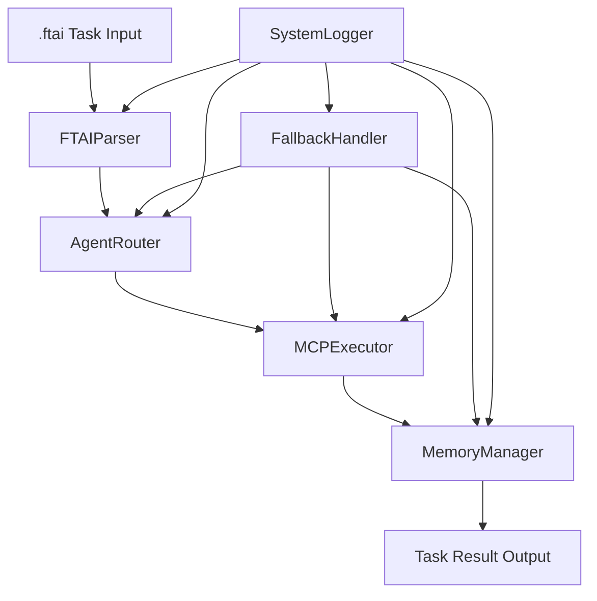
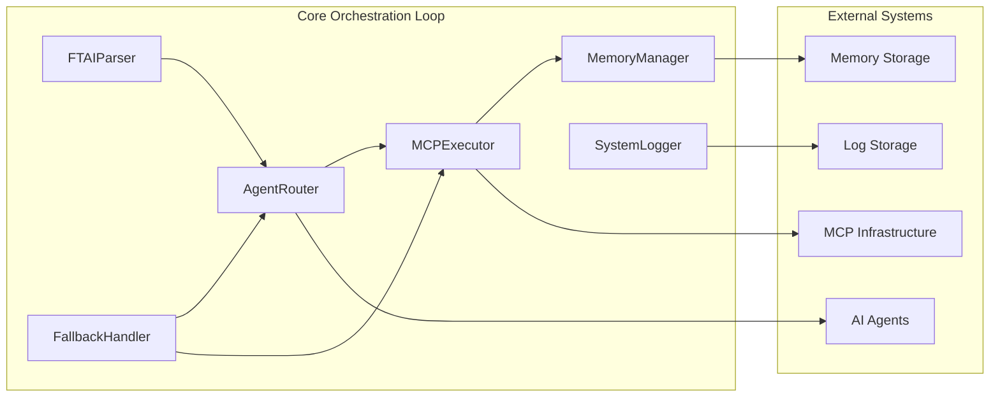

# Core Orchestration Loop Design

## Overview

The Core Orchestration Loop serves as the executive control system for SerenaMaster, implementing the critical ftai → route → exec → return → memory workflow. This system acts as the brainstem that coordinates all agent interactions, maintains system state, and ensures reliable task execution across the entire Serena ecosystem.

The design follows a modular architecture with five core components that work together to create a robust, fault-tolerant orchestration system capable of handling concurrent tasks while maintaining context and state integrity.

## Architecture

### High-Level Flow



### Component Architecture



## Components and Interfaces

### 1. FTAIParser

**Purpose:** Parses and validates .ftai task files according to ftai-spec protocol

**Core Interface:**
```swift
protocol FTAIParserProtocol {
    func parse(ftaiContent: String) async throws -> FTAITask
    func validate(task: FTAITask) throws -> ValidationResult
    func extractRoutingDirectives(task: FTAITask) -> RoutingDirectives
}

struct FTAITask {
    let id: UUID
    let content: String
    let routingDirectives: RoutingDirectives
    let parameters: [String: Any]
    let priority: TaskPriority
    let timestamp: Date
}
```

**Key Responsibilities:**
- Parse .ftai syntax and structure
- Validate required fields and format compliance
- Extract routing information and execution parameters
- Generate structured task objects for downstream processing
- Handle malformed input with detailed error reporting

### 2. AgentRouter

**Purpose:** Intelligently routes parsed tasks to appropriate agents or MCP tools

**Core Interface:**
```swift
protocol AgentRouterProtocol {
    func route(task: FTAITask) async throws -> RoutingDecision
    func selectAgent(for capability: TaskCapability) -> AgentTarget?
    func getFallbackOptions(for target: AgentTarget) -> [AgentTarget]
}

struct RoutingDecision {
    let primaryTarget: AgentTarget
    let fallbackTargets: [AgentTarget]
    let routingReason: String
    let estimatedDuration: TimeInterval
}

enum AgentTarget {
    case jarvis(MCPConnection)
    case claude(MCPConnection)
    case o3(MCPConnection)
    case mcpTool(String, MCPConnection)
}
```

**Key Responsibilities:**
- Analyze task requirements and match to agent capabilities
- Maintain agent capability metadata and availability status
- Implement intelligent routing logic with fallback options
- Log routing decisions for debugging and optimization
- Handle agent unavailability and load balancing

### 3. MCPExecutor

**Purpose:** Executes routed tasks via MCP infrastructure and captures results

**Core Interface:**
```swift
protocol MCPExecutorProtocol {
    func execute(task: FTAITask, target: AgentTarget) async throws -> ExecutionResult
    func monitor(execution: ExecutionSession) async -> ExecutionStatus
    func cancel(execution: ExecutionSession) async throws
}

struct ExecutionResult {
    let taskId: UUID
    let success: Bool
    let output: Any
    let error: Error?
    let duration: TimeInterval
    let intermediateOutputs: [Any]
}

struct ExecutionSession {
    let id: UUID
    let task: FTAITask
    let target: AgentTarget
    let startTime: Date
    let status: ExecutionStatus
}
```

**Key Responsibilities:**
- Establish and manage MCP connections
- Send task parameters to selected agents
- Monitor execution progress and capture intermediate outputs
- Handle timeouts and execution failures
- Validate result format and completeness
- Implement execution recovery procedures

### 4. MemoryManager

**Purpose:** Updates context and state based on task execution results

**Core Interface:**
```swift
protocol MemoryManagerProtocol {
    func updateMemory(from result: ExecutionResult) async throws
    func getContext(for task: FTAITask) async -> MemoryContext
    func cleanup() async throws
}

struct MemoryContext {
    let shortTermMemory: [MemoryEntry]
    let longTermMemory: [MemoryEntry]
    let fileBasedContext: [String: Any]
    let contextThreads: [UUID]
}

struct MemoryEntry {
    let id: UUID
    let content: Any
    let timestamp: Date
    let relevanceScore: Double
    let tags: [String]
}
```

**Key Responsibilities:**
- Update short-term memory with task results
- Determine long-term memory storage requirements
- Maintain file-based memory context
- Implement context threading for related tasks
- Handle memory capacity limits and cleanup
- Ensure memory consistency across concurrent operations

### 5. FallbackHandler

**Purpose:** Provides system reliability through fallback recovery mechanisms

**Core Interface:**
```swift
protocol FallbackHandlerProtocol {
    func handleRoutingFailure(task: FTAITask, error: Error) async -> FallbackAction
    func handleExecutionFailure(session: ExecutionSession, error: Error) async -> FallbackAction
    func handleMemoryFailure(task: FTAITask, error: Error) async -> FallbackAction
}

enum FallbackAction {
    case retry(delay: TimeInterval)
    case reroute(target: AgentTarget)
    case degrade(simplifiedTask: FTAITask)
    case fail(reason: String)
}
```

**Key Responsibilities:**
- Detect and classify system failures
- Implement appropriate recovery strategies
- Maintain system stability during degraded conditions
- Log fallback actions for system improvement
- Coordinate with other components during recovery

### 6. SystemLogger

**Purpose:** Comprehensive logging and monitoring across all orchestration components

**Core Interface:**
```swift
protocol SystemLoggerProtocol {
    func logTaskStart(task: FTAITask)
    func logRoutingDecision(decision: RoutingDecision)
    func logExecutionProgress(session: ExecutionSession, progress: ExecutionProgress)
    func logMemoryUpdate(update: MemoryUpdate)
    func logError(error: Error, context: LogContext)
    func logFallback(action: FallbackAction, reason: String)
}
```

## Data Models

### Core Task Flow Models

```swift
// Primary task representation
struct FTAITask {
    let id: UUID
    let content: String
    let routingDirectives: RoutingDirectives
    let parameters: [String: Any]
    let priority: TaskPriority
    let timestamp: Date
    let dependencies: [UUID]
}

// Routing configuration
struct RoutingDirectives {
    let preferredAgent: String?
    let requiredCapabilities: [TaskCapability]
    let fallbackStrategy: FallbackStrategy
    let timeoutDuration: TimeInterval
}

// Execution tracking
struct ExecutionSession {
    let id: UUID
    let task: FTAITask
    let target: AgentTarget
    let startTime: Date
    let status: ExecutionStatus
    let progress: ExecutionProgress
}
```

### Memory Models

```swift
// Memory context structure
struct MemoryContext {
    let shortTermMemory: [MemoryEntry]
    let longTermMemory: [MemoryEntry]
    let fileBasedContext: [String: Any]
    let contextThreads: [UUID]
    let lastUpdated: Date
}

// Individual memory entries
struct MemoryEntry {
    let id: UUID
    let content: Any
    let timestamp: Date
    let relevanceScore: Double
    let tags: [String]
    let sourceTask: UUID?
}
```

## Error Handling

### Error Classification

```swift
enum OrchestrationError: Error {
    case parsingError(FTAIParsingError)
    case routingError(AgentRoutingError)
    case executionError(MCPExecutionError)
    case memoryError(MemoryManagementError)
    case systemError(SystemFailureError)
}
```

### Error Recovery Strategy

1. **Parsing Errors:** Return structured error with specific field issues
2. **Routing Errors:** Attempt fallback routing or capability degradation
3. **Execution Errors:** Retry with backoff or reroute to alternative agent
4. **Memory Errors:** Log failure but continue task completion
5. **System Errors:** Implement graceful degradation with reduced functionality

### Timeout Handling

- **Parsing Timeout:** 5 seconds maximum
- **Routing Timeout:** 10 seconds maximum
- **Execution Timeout:** Configurable per task type (default 60 seconds)
- **Memory Update Timeout:** 15 seconds maximum

## Testing Strategy

### Unit Testing

- **FTAIParser:** Test parsing of valid/invalid .ftai files, edge cases, malformed input
- **AgentRouter:** Test routing logic, capability matching, fallback selection
- **MCPExecutor:** Test execution flow, timeout handling, result capture
- **MemoryManager:** Test memory updates, context retrieval, cleanup procedures
- **FallbackHandler:** Test error detection, recovery strategies, degradation modes

### Integration Testing

- **End-to-End Flow:** Complete ftai → route → exec → return → memory cycles
- **Concurrent Processing:** Multiple simultaneous tasks with shared resources
- **Error Scenarios:** Systematic testing of failure modes and recovery
- **Performance Testing:** Load testing with high task volumes
- **Memory Consistency:** Verify memory state across concurrent operations

### Test Data

- **Valid .ftai Files:** Covering all supported task types and routing scenarios
- **Invalid .ftai Files:** Malformed syntax, missing fields, invalid parameters
- **Mock MCP Responses:** Simulated agent responses for consistent testing
- **Error Conditions:** Network failures, agent unavailability, timeout scenarios

### Continuous Testing

- **Automated Test Suite:** Run on every code change
- **Performance Benchmarks:** Track execution times and memory usage
- **Error Rate Monitoring:** Track failure rates and recovery success
- **Integration Health Checks:** Verify MCP connectivity and agent availability