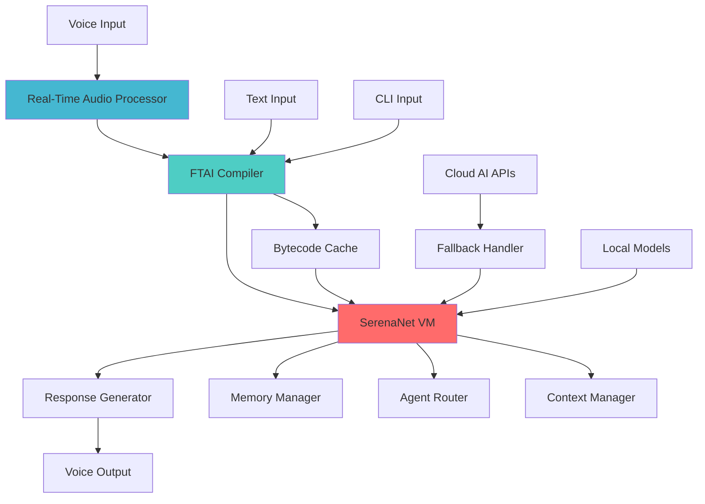
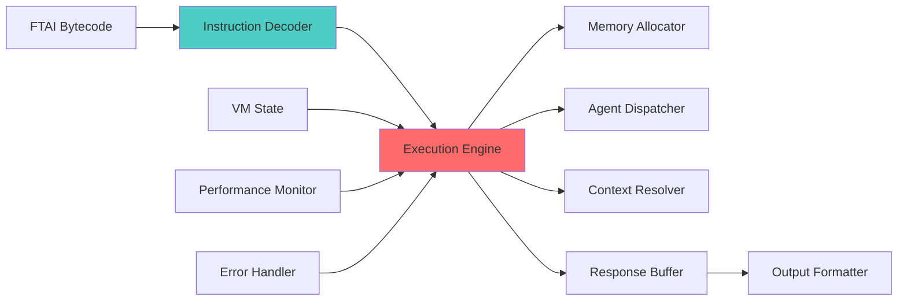
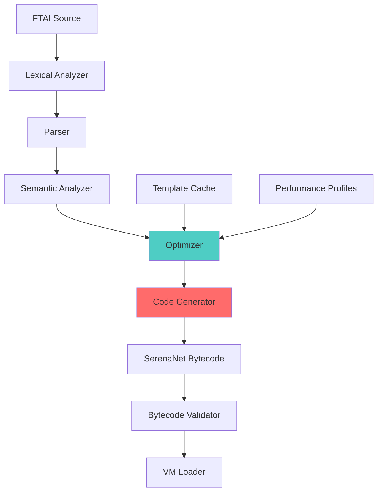

# Design Document

## Overview

The SerenaNet integration transforms SerenaMaster into a real-time AI system capable of sub-500ms response times through a revolutionary virtual machine architecture. SerenaNet VM executes FTAI (Fast-Time AI) bytecode to deliver instant AI responses, making Serena feel truly "alive" in conversations. This integration bridges the gap between traditional AI systems and real-time human interaction, creating the foundation for breakthrough AI demonstrations including TED talks and live presentations.

The core innovation lies in pre-compiling FTAI operations into optimized bytecode that can be executed instantly by the SerenaNet VM, eliminating the traditional parsing and processing delays that make AI interactions feel sluggish.

## Architecture

### High-Level Architecture



### SerenaNet VM Architecture



### FTAI Compilation Pipeline



## Components and Interfaces

### 1. SerenaNet VM Core

**Purpose**: The heart of the real-time execution system that runs FTAI bytecode with minimal latency.

**Key Components**:
- **Instruction Decoder**: Converts bytecode to executable operations
- **Execution Engine**: Processes instructions with sub-millisecond timing
- **Memory Manager**: Handles VM memory allocation and garbage collection
- **Performance Monitor**: Tracks execution metrics and optimization opportunities

**Interface**:
```swift
protocol SerenaNetVMProtocol {
    func initialize() async throws
    func loadBytecode(_ bytecode: FTAIBytecode) async throws
    func execute(with context: ExecutionContext) async throws -> VMExecutionResult
    func getPerformanceMetrics() -> VMPerformanceMetrics
    func shutdown() async
}
```

### 2. FTAI Compiler

**Purpose**: Converts FTAI source code into optimized SerenaNet bytecode for instant execution.

**Key Components**:
- **Lexical Analyzer**: Tokenizes FTAI source code
- **Parser**: Builds abstract syntax tree from tokens
- **Semantic Analyzer**: Validates semantics and resolves references
- **Optimizer**: Applies performance optimizations
- **Code Generator**: Produces SerenaNet bytecode

**Interface**:
```swift
protocol FTAICompilerProtocol {
    func compile(_ ftaiSource: String) async throws -> FTAIBytecode
    func compileWithOptimization(_ ftaiSource: String, level: OptimizationLevel) async throws -> FTAIBytecode
    func validateSyntax(_ ftaiSource: String) async throws -> ValidationResult
    func getCompilationMetrics() -> CompilationMetrics
}
```

### 3. Real-Time Audio Processor

**Purpose**: Processes voice input with minimal latency for immediate FTAI compilation and execution.

**Key Components**:
- **Voice Activity Detection**: Detects speech start/end with <50ms latency
- **Streaming Speech Recognition**: Converts audio to text in real-time
- **Intent Classifier**: Rapidly classifies user intent from partial speech
- **Context Predictor**: Predicts likely completions for faster processing

**Interface**:
```swift
protocol RealTimeAudioProcessorProtocol {
    func startListening() async throws
    func stopListening() async
    func processAudioStream(_ audioData: Data) async throws -> AudioProcessingResult
    func setVoiceProfile(_ profile: VoiceProfile) async
}
```

### 4. SerenaNet Bridge

**Purpose**: Integrates SerenaNet VM with existing SerenaMaster infrastructure.

**Key Components**:
- **FTAI Runtime Bridge**: Connects existing FTAI runtime to SerenaNet VM
- **Memory Context Bridge**: Provides VM access to SerenaMaster memory
- **Agent Router Bridge**: Routes VM requests to appropriate agents
- **Performance Bridge**: Integrates VM metrics with SerenaMaster monitoring

**Interface**:
```swift
protocol SerenaNetBridgeProtocol {
    func initializeBridge() async throws
    func routeToVM(_ ftaiTask: FTAITask) async throws -> ExecutionResult
    func routeToTraditional(_ ftaiTask: FTAITask) async throws -> ExecutionResult
    func getRoutingDecision(_ ftaiTask: FTAITask) async -> RoutingDecision
}
```

### 5. Bytecode Cache Manager

**Purpose**: Manages compiled bytecode cache for instant execution of common operations.

**Key Components**:
- **Cache Storage**: Persistent storage for compiled bytecode
- **Cache Invalidation**: Smart invalidation based on source changes
- **Precompilation Engine**: Proactively compiles likely operations
- **Cache Optimization**: Optimizes cache based on usage patterns

**Interface**:
```swift
protocol BytecodeCacheManagerProtocol {
    func getCachedBytecode(_ ftaiHash: String) async -> FTAIBytecode?
    func cacheBytecode(_ bytecode: FTAIBytecode, for ftaiHash: String) async
    func precompileCommonOperations() async
    func optimizeCache() async
}
```

## Data Models

### Core SerenaNet Models

```swift
// SerenaNet VM execution context
struct VMExecutionContext {
    let taskId: UUID
    let bytecode: FTAIBytecode
    let memoryContext: MemoryContext
    let agentContext: AgentContext
    let performanceRequirements: PerformanceRequirements
    let timestamp: Date
}

// FTAI bytecode representation
struct FTAIBytecode {
    let id: UUID
    let sourceHash: String
    let instructions: [VMInstruction]
    let metadata: BytecodeMetadata
    let optimizationLevel: OptimizationLevel
    let compiledAt: Date
}

// VM instruction format
struct VMInstruction {
    let opcode: VMOpcode
    let operands: [VMOperand]
    let metadata: InstructionMetadata
}

// VM execution result
struct VMExecutionResult {
    let taskId: UUID
    let success: Bool
    let output: Any?
    let executionTime: TimeInterval
    let memoryUsage: Int64
    let instructionsExecuted: Int
    let error: VMError?
}

// Performance requirements for sub-500ms execution
struct PerformanceRequirements {
    let maxExecutionTime: TimeInterval // Target: 0.5 seconds
    let maxMemoryUsage: Int64
    let priorityLevel: ExecutionPriority
    let fallbackStrategy: VMFallbackStrategy
}
```

### Audio Processing Models

```swift
// Real-time audio processing result
struct AudioProcessingResult {
    let transcription: String
    let confidence: Double
    let processingTime: TimeInterval
    let intentClassification: IntentClassification?
    let isComplete: Bool
}

// Voice profile for personalized processing
struct VoiceProfile {
    let userId: String
    let language: String
    let acousticModel: String
    let customVocabulary: [String]
    let speakingRate: Double
}

// Intent classification for rapid response
struct IntentClassification {
    let intent: String
    let confidence: Double
    let parameters: [String: Any]
    let suggestedAgent: String?
}
```

### Compilation Models

```swift
// Compilation metrics for optimization
struct CompilationMetrics {
    let sourceSize: Int
    let bytecodeSize: Int
    let compilationTime: TimeInterval
    let optimizationLevel: OptimizationLevel
    let instructionCount: Int
    let estimatedExecutionTime: TimeInterval
}

// Optimization levels for different scenarios
enum OptimizationLevel: String, CaseIterable {
    case none = "none"           // Fastest compilation
    case basic = "basic"         // Basic optimizations
    case performance = "performance" // Optimize for speed
    case size = "size"          // Optimize for memory
    case demo = "demo"          // Optimize for live demos
}

// Bytecode metadata for caching and optimization
struct BytecodeMetadata {
    let sourceLanguage: String
    let targetVM: String
    let dependencies: [String]
    let performanceProfile: PerformanceProfile
    let cacheKey: String
}
```

## Error Handling

### VM Error Types

```swift
enum VMError: Error {
    case compilationFailed(reason: String)
    case executionTimeout(duration: TimeInterval)
    case memoryExhausted(requested: Int64, available: Int64)
    case invalidBytecode(instruction: VMInstruction)
    case agentUnavailable(agentName: String)
    case contextCorrupted(contextId: UUID)
    case performanceThresholdExceeded(metric: String, value: Double)
}
```

### Error Recovery Strategies

1. **Compilation Errors**: Fall back to traditional FTAI parsing
2. **Execution Timeouts**: Switch to simplified execution path
3. **Memory Issues**: Trigger garbage collection and retry
4. **Agent Unavailability**: Route to fallback agent or local processing
5. **Performance Issues**: Reduce optimization level and retry

### Graceful Degradation

```swift
enum DegradationLevel {
    case none                    // Full SerenaNet performance
    case reducedOptimization    // Lower optimization, still fast
    case hybridExecution        // Mix of VM and traditional processing
    case traditionalFallback    // Fall back to existing FTAI runtime
    case emergencyMode          // Minimal functionality only
}
```

## Testing Strategy

### Performance Testing

1. **Latency Testing**
   - Measure end-to-end response times
   - Target: <500ms for 95% of operations
   - Test with various input types and complexities

2. **Throughput Testing**
   - Concurrent execution capabilities
   - Memory usage under load
   - Cache hit rates and effectiveness

3. **Stress Testing**
   - Extended operation periods
   - Memory leak detection
   - Performance degradation analysis

### Functional Testing

1. **Compilation Testing**
   - FTAI syntax coverage
   - Optimization correctness
   - Bytecode validation

2. **Execution Testing**
   - VM instruction correctness
   - Context handling accuracy
   - Agent routing functionality

3. **Integration Testing**
   - SerenaMaster compatibility
   - Memory system integration
   - Voice processing pipeline

### Demo Preparation Testing

1. **Live Demo Scenarios**
   - TED talk presentation flow
   - Network failure handling
   - Audience interaction patterns

2. **Reliability Testing**
   - Consistent performance under pressure
   - Recovery from unexpected inputs
   - Graceful error handling

### Test Implementation

```swift
// Performance test suite
class SerenaNetPerformanceTests {
    func testSubSecondResponse() async throws {
        let startTime = Date()
        let result = try await serenaNetVM.execute(testBytecode)
        let duration = Date().timeIntervalSince(startTime)
        XCTAssertLessThan(duration, 0.5, "Response time exceeded 500ms")
    }
    
    func testConcurrentExecution() async throws {
        // Test multiple simultaneous executions
    }
    
    func testMemoryEfficiency() async throws {
        // Test memory usage patterns
    }
}

// Demo readiness test suite
class DemoReadinessTests {
    func testTEDTalkScenario() async throws {
        // Simulate TED talk interaction patterns
    }
    
    func testNetworkFailureRecovery() async throws {
        // Test offline capabilities
    }
    
    func testAudienceInteraction() async throws {
        // Test handling of unexpected inputs
    }
}
```

## Implementation Phases

### Phase 1: Core VM Implementation (Week 1-2)
- Implement basic SerenaNet VM
- Create FTAI compiler foundation
- Build bytecode execution engine
- Establish performance monitoring

### Phase 2: Audio Integration (Week 2-3)
- Implement real-time audio processing
- Create voice-to-FTAI pipeline
- Optimize for sub-500ms response
- Test voice interaction flows

### Phase 3: SerenaMaster Integration (Week 3-4)
- Build SerenaNet bridge components
- Integrate with existing memory system
- Connect to agent routing infrastructure
- Implement fallback mechanisms

### Phase 4: Optimization & Demo Prep (Week 4-5)
- Performance tuning and optimization
- Cache implementation and tuning
- Demo scenario testing
- TED talk preparation

### Phase 5: Production Readiness (Week 5-6)
- Comprehensive testing suite
- Error handling refinement
- Documentation and deployment
- Live demo validation

This design creates the foundation for making Serena truly "alive" with instant responses that will revolutionize how people interact with AI systems. The TED talk demonstration will showcase this breakthrough technology in action.